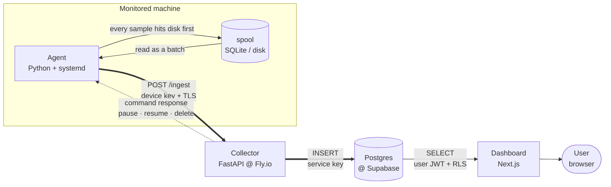

# TraceBox

**Remote log-shipping and monitoring** — for machines that may not survive long enough to tell you what happened to them.

A small **agent** runs on every monitored machine. It continuously collects the machine's metrics (CPU, RAM, disk, network) and system logs and ships them to the cloud **before** the machine goes down. By the time the machine becomes unreachable, the events leading up to the crash are already somewhere else — readable from any browser.

Like an aircraft's black box: it records up to the last moment, and it sits where the crash cannot reach it.

---

## Why it works this way

The obvious design is *"let's store the logs in the cloud."* But the hard part is not storing them — it is **getting the data off the machine while the event is still happening.**

If a machine tries to upload its final state *while* it is going down, it is already too late: the thing that is failing is usually the network stack, the disk, or the process itself. "Report it as you crash" kicks in at exactly the moment the reporting mechanism is broken.

TraceBox inverts that:

- **It ships continuously.** Data keeps flowing in normal times, when nothing is wrong.
- **It ships harder when a threshold is crossed.** Past 90% CPU it does not wait for the next scheduled send; the spool is emptied immediately (emergency flush).
- **When the machine dies**, the data you care about is already outside.

---

## The big picture



There are **two separate paths** in the system, and they deliberately never cross:

| Path | Who | Goes through | With which identity |
|---|---|---|---|
| **WRITE** | Agent | The collector | `device key` — one per host, revocable one by one |
| **READ** | Dashboard | Postgres directly | `user JWT` — protected row by row through RLS |

The agent **never touches the database directly**; the database's service key lives **only in the collector**. The dashboard does not write at all — it only reads.

---

## Technology used

| Component | Stack | Where it runs | Role |
|---|---|---|---|
| **Agent** | Python 3.11+, `psutil`, `httpx`, SQLite | The monitored machine, as a `systemd` service | Collects, spools to disk, ships. Runs as an unprivileged user. |
| **Collector** | Python, FastAPI, Docker | Fly.io | The system's only write gate. Resolves the host identity from a key hash. |
| **Database** | PostgreSQL | Supabase | Storage + Auth + Row-Level Security + retention via `pg_cron`. |
| **Dashboard** | Next.js, Tailwind CSS | Fly.io | A read-only window. Talks to Postgres directly. |

---

## Where do the requests go?

Every endpoint the collector exposes, and who it accepts:

| Who → whom | Endpoint | Identity | What it does |
|---|---|---|---|
| Agent → Collector | `POST /inventory` | device key | Writes the machine's hardware profile over the `devices` row |
| Agent → Collector | `POST /ingest` | device key | Inserts metric / log / crash records, acks commands |
| Agent → Collector | `GET /commands` | device key | Pulls pending `pause` / `resume` / `delete` commands |
| Agent → Collector | `GET /verify` | device key | Post-install connection test |
| Dashboard → Collector | `POST /devices` | user JWT | Creates a host and generates a device key (shown once) |
| Dashboard → Postgres | `SELECT` | user JWT | Never goes near the collector; RLS protects it |

---

## What does the agent collect?

### Metrics — every 5 seconds by default

| Field | What it measures |
|---|---|
| `cpu_percent` | CPU usage since the previous sample |
| `ram_used_mb` | RAM in use — `total − available` (reclaimable space such as cache excluded) |
| `disk_percent` | How full the root directory (`/`) is |
| `net_sent_mb` / `net_recv_mb` | Network traffic — not total bytes but a **rate in MB/s**, loopback excluded |

A field that cannot be computed (the first sample, a counter reset after a reboot) is written as **`null`**, not `0`: "I could not measure it" is never confused with "it was zero".

**Optional add-ons** — switched on one by one in `config.toml`, `null` while off:
`temperature` · `swap` · `load_avg` · `gpu` · `external_ip` · `crash_processes`

### Logs

Read from `journald` and **normalized** to a fixed shape: `{ timestamp, level, message, source }`. There are only 4 levels: `info` · `warning` · `error` · `critical`.

The agent keeps a **cursor**, so it picks up where it left off even after a restart; no log is repeated and none is skipped. The agent's own routine (`info`) lines are filtered out — a log shipper that ships its own chatter would spend most of its budget describing itself. Everything `journald`-specific is isolated in a single directory (`logsources/`), so adding support for another operating system does not touch the core.

### Inventory (the machine's profile)

`cpu_model`, core counts, `arch`, `ram_total_mb`, `disk_total_mb`, `os_name` / `os_version`, `kernel_version`, `last_boot`, `agent_version`.

These rarely change, so they are not stored as a time series — they are read at startup, compared against the previous reading, and sent (overwriting the `devices` row) **only if something changed**.

### Crash snapshot

The moment a threshold is crossed (emergency flush), if the `crash_processes` add-on is on, the 5 heaviest processes are recorded. That way the answer to "what choked the machine" does not disappear along with the machine.

### Timing — defaults

| What | How often |
|---|---|
| Sampling | 5 s |
| Shipping to the cloud | 10 s (the code floors this at 10 s) |
| Command poll | 10 s |
| Emergency flush | Past 90% CPU · 90% RAM · 95% disk — with a 10 s cooldown |
| Data retention | 10 days, then `pg_cron` deletes it |

All of these are managed from `config.toml` on the machine, and the agent re-reads that file on every tick — **no service restart is needed for a change to take effect.**

---

## Data model

```
accounts                 (one user = one account)
   └── devices           (that account's machines + inventory + device key hash)
         ├── metrics             sample rows
         ├── logs                normalized log rows
         ├── crash_snapshots     the process list at flush time
         └── commands            the pause / resume / delete queue
```

Every row carries both `device_id` and `account_id`. Repeating `account_id` (denormalization) is deliberate: it lets the RLS rule and the retention job work without a single `JOIN`.

**Row-Level Security** is on for every table and the rule is the same everywhere: `account_id = auth.uid()`. A user cannot see a single row that does not belong to their account — and that constraint is enforced **inside the database**, not in application code.

---

## Notable design decisions

**Hosts do not get to say who they are.**
There is no `device_id` inside the payloads. The agent only presents a key; the collector hashes it, matches it against `devices.key_hash`, and derives both `device_id` and `account_id` itself. A compromised agent cannot write into another account's data — it has no way to name that account.

**The service key never leaves the collector.**
The Supabase service key bypasses RLS; distributing it to every monitored machine would turn a single compromised host into a full database breach. Instead each host carries its own key, revocable one at a time.

**Single writer.**
Every piece of data has exactly one owner: only the agent writes `state.json`; only the collector writes `last_seen`, `key_hash` and command status. This is not left to convention — it is enforced at the database level with column-level grants.

**At-least-once delivery + idempotency.**
The agent writes every record to the on-disk spool first and only deletes it after a `200`. Retries are therefore expected — which is why every record carries a UUID generated by the agent and the server inserts with `ON CONFLICT DO NOTHING`. The result: sending the same record twice produces no duplicate, and losing data would take the disk itself failing.

**Pause does not stop recording.**
Pausing a host stops the *upload*, not the *collection*. Data keeps piling up locally and flows out in order on resume. Command polling continues during a pause too — otherwise a `resume` command could never reach the host. Command acks do not stop either, for the same reason: an ack is a control message, not telemetry, and carries no sample rows. If it stopped, the server would never learn the command was applied, would resend the same `pause` forever, and the dashboard would still show the host as running.

**Deletion has an order.**
Removing a host does not delete the row right away. First a `delete` command enters the queue; the agent picks it up on a poll, acks it **first**, and cleans up locally only after seeing the `200`. The collector drops the row on that ack. The order matters in both directions: had the row been deleted early, the key would be invalid instantly and the agent would never learn it should remove itself; had the local wipe run before the ack, the key would be gone along with any chance of sending that ack, and the row would live forever on the server.

The second half of that cleanup is **outside** the agent's privileges: the service runs as an unprivileged user under `NoNewPrivileges=yes` and `ProtectSystem=strict` — it cannot remove its own installation and cannot touch systemd. So the agent drops a marker file in the only place it can write, its own state directory; a systemd `path` unit waiting on the root side sees it and runs `uninstall.sh`. Delete completes end to end without the agent gaining a gram of privilege.

**The agent has limits.**
The on-disk spool is a ring buffer bounded by both age (10 days) and size (200 MB); past either limit the oldest record is dropped. A monitoring tool that fills up the disk of the machine it watches has caused the very outage it was supposed to explain.

---

## Repository layout

```
agent/         Python agent — runs on the monitored machine
  core/          platform-independent: loop, config, state, metrics, spool, shipper
  logsources/    OS-specific log readers, behind a shared interface
collector/     FastAPI service @ Fly.io — the system's only write gate
dashboard/     Next.js read interface
db/            schema, triggers, row-level security, retention
```

## Running the collector locally

```bash
cd collector
python -m venv .venv && source .venv/bin/activate
pip install -r requirements.txt
uvicorn main:app --reload --port 8080
curl localhost:8080/health
```

## Database setup

Against a Supabase project, run these in order:

```
db/schema.sql  →  db/triggers.sql  →  db/rls.sql
```

The order matters: the triggers reference the `accounts` table, and the policies reference every table.

---

## Status

Under active development. The project is built in **vertical slices** — each step is a thin path that works end to end, not a horizontal layer.

---

## License

TraceBox is licensed under the TraceBox License v1.0.

See [LICENSE](./LICENSE) for the complete license terms.
