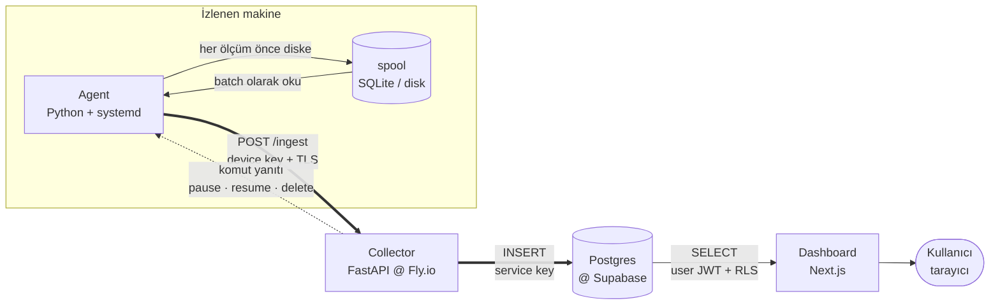

# TraceBox

**Uzaktan log-shipping ve monitoring** — başına ne geldiğini anlatacak kadar hayatta kalamayabilecek makineler için.

İzlenen her makinede küçük bir **agent** çalışır. Bu agent makinenin metriklerini (CPU, RAM, disk, ağ) ve system log'larını sürekli toplar ve makine çökmeden **önce** buluta gönderir. Makine erişilemez hale geldiğinde, çöküşe kadar olan olaylar çoktan başka bir yerdedir — herhangi bir tarayıcıdan okunabilir.

Uçağın kara kutusu gibi: son ana kadar kaydeder ve çöküşün ulaşamayacağı yerde durur.

---

## Neden böyle çalışıyor?

Akla ilk gelen kurgu şudur: *"log'ları bulutta saklayalım."* Ama asıl sorun saklamak değil, **olay hâlâ olurken veriyi makinenin dışına taşımak.**

Bir makine çöktüğü *sırada* son durumunu upload etmeye çalışıyorsa, iş zaten bitmiştir: arızalanan şey genellikle network stack'in, disk'in ya da process'in ta kendisidir. Yani "çökerken haber ver" mantığı, tam da haber verecek mekanizmanın bozulduğu anda devreye girer.

TraceBox bunu tersine çevirir:

- **Sürekli ship eder.** Veri normal zamanlarda, hiçbir sorun yokken akmaya devam eder.
- **Threshold aşılınca daha sıkı ship eder.** CPU %90'ı geçtiğinde sıradaki gönderim zamanı beklenmez; spool anında boşaltılır (emergency flush).
- **Makine öldüğünde**, ilgilenilen veri çoktan dışarı çıkmıştır.

---

## Genel tablo



Sistemde **iki ayrı yol** var ve bunlar bilerek hiç kesişmiyor:

| Yol | Kim | Nereden geçer | Hangi kimlikle |
|---|---|---|---|
| **WRITE** (yazma) | Agent | Collector üzerinden | `device key` — cihaz başına, tek tek revoke edilebilir |
| **READ** (okuma) | Dashboard | Doğrudan Postgres'ten | `user JWT` — RLS ile satır bazında korunur |

Agent database'e **asla doğrudan dokunmaz**; database'in service key'i **yalnızca collector'da** durur. Dashboard ise yazmaz, sadece okur.

---

## Kullanılan teknolojiler

| Bileşen | Stack | Nerede çalışır | Rolü |
|---|---|---|---|
| **Agent** | Python 3.11+, `psutil`, `httpx`, SQLite | İzlenen makine, `systemd` service olarak | Toplar, disk'e spool eder, ship eder. Unprivileged bir kullanıcı ile çalışır. |
| **Collector** | Python, FastAPI, Docker | Fly.io | Sistemin tek yazma kapısı. Cihaz kimliğini key hash'inden çözer. |
| **Database** | PostgreSQL | Supabase | Depolama + Auth + Row-Level Security + `pg_cron` ile retention. |
| **Dashboard** | Next.js, Tailwind CSS | Vercel | Salt-okunur pencere. Postgres ile doğrudan konuşur. |

---

## İstekler nereye gidiyor?

Collector'ın tüm endpoint'leri ve kimleri kabul ettiği:

| Kim → Kime | Endpoint | Kimlik | Ne yapar |
|---|---|---|---|
| Agent → Collector | `POST /inventory` | device key | Makinenin künyesini `devices` satırının üzerine yazar |
| Agent → Collector | `POST /ingest` | device key | metric / log / crash kayıtlarını insert eder, komutları ack'ler |
| Agent → Collector | `GET /commands` | device key | Bekleyen `pause` / `resume` / `delete` komutlarını çeker |
| Agent → Collector | `GET /verify` | device key | Kurulum sonrası bağlantı testi |
| Dashboard → Collector | `POST /devices` | user JWT | Yeni cihaz oluşturur ve device key üretir (key bir kez gösterilir) |
| Dashboard → Postgres | `SELECT` | user JWT | Collector'a hiç uğramaz; RLS korur |

---

## Agent ne topluyor?

### Metrikler — varsayılan olarak 5 saniyede bir

| Alan | Ne ölçüyor |
|---|---|
| `cpu_percent` | Önceki ölçümden bu yana CPU kullanım yüzdesi |
| `ram_used_mb` | Kullanımdaki RAM — `total − available` (cache gibi geri alınabilir alanlar düşülmüş) |
| `disk_percent` | Kök dizinin (`/`) doluluk oranı |
| `net_sent_mb` / `net_recv_mb` | Ağ trafiği — toplam bayt değil, **MB/s cinsinden hız** |

Hesaplanamayan bir alan (ilk ölçüm, reboot sonrası sıfırlanan sayaç) `0` değil **`null`** yazılır: "ölçemedim" ile "sıfırdı" birbirine karıştırılmaz.

**Opsiyonel add-on'lar** — `config.toml`'dan tek tek açılır, kapalıyken `null` kalır:
`temperature` · `swap` · `load_avg` · `gpu` · `external_ip` · `crash_processes`

### Log'lar

`journald`'dan okunur ve sabit bir şekle **normalize** edilir: `{ timestamp, level, message, source }`. Sadece 4 level var: `info` · `warning` · `error` · `critical`.

Agent bir **cursor** tuttuğu için yeniden başlasa bile kaldığı yerden devam eder; log ne tekrarlanır ne atlanır. `journald`'a özgü kod tek bir dosyada izole edilmiştir (`logsources/`), böylece başka bir işletim sistemi desteği eklemek çekirdeği hiç değiştirmez.

### Envanter (makinenin künyesi)

`cpu_model`, çekirdek sayıları, `arch`, `ram_total_mb`, `disk_total_mb`, `os_name` / `os_version`, `kernel_version`, `last_boot`, `agent_version`.

Bunlar nadiren değiştiği için zaman serisi olarak saklanmaz — açılışta okunur, bir öncekiyle karşılaştırılır ve **yalnızca değiştiyse** gönderilip `devices` satırının üzerine yazılır.

### Crash snapshot

Bir threshold aşıldığı anda (emergency flush), `crash_processes` add-on'u açıksa en çok kaynak tüketen ilk 5 process kaydedilir. Böylece "makine neden boğuldu" sorusunun cevabı çöküşle birlikte kaybolmaz.

### Zamanlama — varsayılanlar

| Ne | Ne sıklıkla |
|---|---|
| Ölçüm toplama | 5 sn |
| Buluta gönderim | 30 sn (kod bunu en az 10 sn ile sınırlar) |
| Komut yoklama (poll) | 10 sn |
| Emergency flush | CPU %90 · RAM %90 · disk %95 aşılınca — 20 sn cooldown ile |
| Verinin saklanma süresi | 10 gün, sonra `pg_cron` siler |

Bu değerlerin hepsi makinedeki `config.toml`'dan yönetilir ve agent dosyayı her tick'te yeniden okur — **değişiklik için servisi yeniden başlatmak gerekmez.**

---

## Veri modeli

```
accounts                 (bir kullanıcı = bir account)
   └── devices           (o account'a ait makineler + envanter + device key hash'i)
         ├── metrics             ölçüm satırları
         ├── logs                normalize edilmiş log satırları
         ├── crash_snapshots     flush anındaki process listesi
         └── commands            pause / resume / delete kuyruğu
```

Her satır hem `device_id` hem `account_id` taşır. `account_id`'nin tekrarlanması (denormalization) bilinçlidir: RLS kuralı ve retention job'ı hiçbir `JOIN` yapmadan çalışabilsin diye.

Bütün tablolarda **Row-Level Security** açık ve kural her yerde aynı: `account_id = auth.uid()`. Yani bir kullanıcı, kendi hesabına ait olmayan tek bir satırı bile göremez — bu kısıt uygulama kodunda değil, **database'in içinde** zorunlu kılınmıştır.

---

## Öne çıkan tasarım kararları

**Cihazlar kendi kimliğini kendisi söylemez.**
Payload'ların içinde `device_id` yoktur. Agent sadece bir key sunar; collector bunu hash'leyip `devices.key_hash` ile eşleştirir ve hem `device_id`'yi hem `account_id`'yi kendisi türetir. Ele geçirilmiş bir agent başka bir hesabın verisine yazamaz — çünkü elinde o hesabı adlandıracak bir yol yoktur.

**Service key collector'dan asla çıkmaz.**
Supabase service key'i RLS'i bypass eder; onu izlenen her makineye dağıtmak, ele geçirilen tek bir makineyi bütün bir database breach'ine çevirirdi. Bunun yerine her cihaz kendine ait, tek tek iptal edilebilen bir key taşır.

**Single writer.**
Her veri parçasının sahibi tam olarak tek bir bileşendir: `state.json`'ı yalnızca agent yazar; `last_seen`, `key_hash` ve komut durumunu yalnızca collector yazar. Bu kural teamül olarak bırakılmamış, column-level grant'lerle database seviyesinde zorunlu kılınmıştır.

**At-least-once delivery + idempotency.**
Agent her kaydı önce disk'teki spool'a yazar ve ancak `200` cevabını aldıktan sonra siler. Bu yüzden retry beklenen bir durumdur — dolayısıyla her kayıt agent'ın ürettiği bir `UUID` taşır ve server `ON CONFLICT DO NOTHING` ile insert eder. Sonuç: aynı kayıt iki kez gönderilse bile duplicate oluşmaz, veri kaybı içinse disk'in kendisinin arızalanması gerekir.

**Pause, kaydı durdurmaz.**
Bir cihazı pause etmek *upload*'ı durdurur, *toplamayı* değil. Veri yerelde birikmeye devam eder ve resume'da sırayla akar. Pause sırasında komut yoklaması da devam eder — aksi hâlde `resume` komutu cihaza hiçbir zaman ulaşamazdı. Komut ack'i de aynı sebeple durmaz: o bir telemetri değil kontrol mesajıdır ve tek bir ölçüm satırı taşımaz. Durdurulsaydı server komutun uygulandığını hiç öğrenemez, aynı `pause`u sonsuza kadar yeniden gönderir ve dashboard cihazı hâlâ "çalışıyor" gösterirdi.

**Silme işleminin bir sırası vardır.**
Bir cihazı kaldırmak satırı hemen silmez. Önce kuyruğa bir `delete` komutu girer; agent komutu poll'da alır, **önce** ack'ler ve `200` cevabını gördükten sonra yerelini temizler. Collector satırı ancak o ack ile düşürür. Sıra her iki yönde de kritiktir: satır erken silinseydi key anında geçersizleşir ve agent kendisini kaldırması gerektiğini hiç öğrenemezdi; yerel temizlik ack'ten önce yapılsaydı key ile birlikte ack'i gönderme imkânı da giderdi ve satır sunucuda ölümsüz kalırdı.

Temizliğin ikinci yarısı ise agent'ın yetkisi **dışındadır**: servis yetkisiz bir kullanıcıyla, `NoNewPrivileges=yes` ve `ProtectSystem=strict` altında çalışır — kendi kurulumunu kaldıramaz, systemd'ye dokunamaz. Bu yüzden agent yalnızca yazabildiği tek yere, kendi state dizinine bir işaret dosyası bırakır; root tarafında bekleyen bir systemd `path` unit'i onu görür ve `uninstall.sh`'i çalıştırır. Böylece delete uçtan uca tamamlanır ama agent'ın yetkisi bir gram artmaz.

**Agent'ın sınırları vardır.**
Disk'teki spool hem yaş (10 gün) hem boyut (200 MB) ile sınırlanmış bir ring buffer'dır; sınır aşılınca en eski kayıt düşer. İzlediği makinenin disk'ini dolduran bir monitoring aracı, açıklaması beklenen outage'a kendisi sebep olmuş olur.

---

## Repo yapısı

```
agent/         Python agent — izlenen makinede çalışır
  core/          platform-bağımsız: loop, config, state, metrics, spool, shipper
  logsources/    OS'a özgü log okuyucular, ortak bir interface arkasında
collector/     FastAPI service @ Fly.io — sistemin tek yazma kapısı
dashboard/     Next.js okuma arayüzü
db/            şema, trigger'lar, row-level security, retention
```

## Collector'ı yerelde çalıştırma

```bash
cd collector
python -m venv .venv && source .venv/bin/activate
pip install -r requirements.txt
uvicorn main:app --reload --port 8080
curl localhost:8080/health
```

## Database kurulumu

Bir Supabase projesine karşı, şu sırayla çalıştır:

```
db/schema.sql  →  db/triggers.sql  →  db/rls.sql
```

Sıra önemli: trigger'lar `accounts` tablosuna referans verir, policy'ler de her tabloya.

---

## Durum

Aktif geliştirme aşamasında. Proje **vertical slice**'lar hâlinde inşa ediliyor — her adım yatay bir katman değil, uçtan uca çalışan ince bir yol.

---

## License

TraceBox is licensed under the TraceBox License v1.0.

See [LICENSE](./LICENSE) for the complete license terms.

## Lisans

TraceBox, TraceBox License v1.0 ile lisanslanmıştır.

Lisansın tam şartları için [LICENSE](./LICENSE) dosyasına bakınız.
